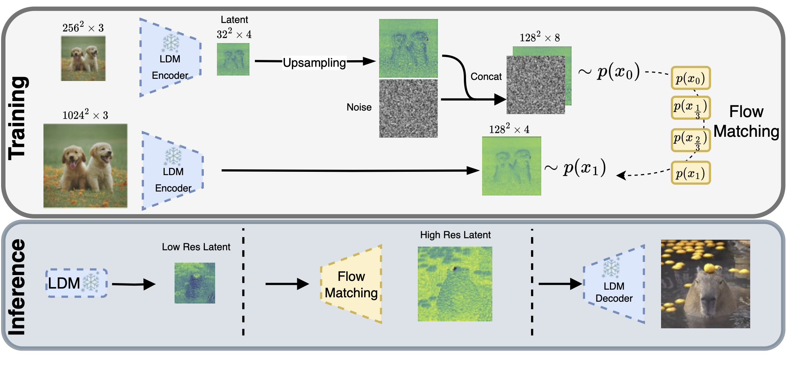
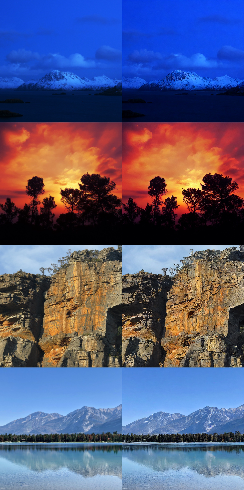
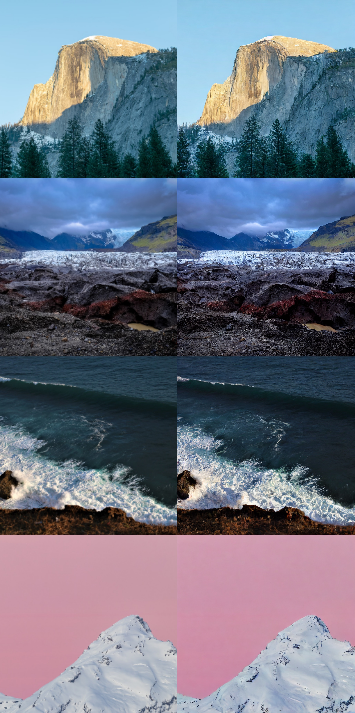

# fm-boosting
Boosting Latent Diffusion with Flow Matching

# Abstract
Recently, there has been tremendous progress in visual synthesis and the underlying generative models. Here, diffusion models (DMs) stand out particularly, but lately, flow matching (FM) has also garnered considerable interest. While DMs excel in providing diverse images, they suffer from long training and slow generation. With latent diffusion, these issues are only partially alleviated. Conversely, FM offers faster training and inference but exhibits less diversity in synthesis. 

We demonstrate that introducing FM between the Diffusion model and the convolutional decoder offers high-resolution image synthesis with reduced computational cost and model size.
Diffusion can then efficiently provide the necessary generation diversity. FM compensates for the lower resolution, mapping the small latent space to a high-dimensional one. Subsequently, the convolutional decoder of the LDM maps these latents to high-resolution images. By combining the diversity of DMs, the efficiency of FMs, and the effectiveness of convolutional decoders, we achieve state-of-the-art high-resolution image synthesis at $1024^2$ with minimal computational cost. Importantly, our approach is orthogonal to recent approximation and speed-up strategies for the underlying DMs, making it easily integrable into various DM frameworks.

# Preprint & Code coming soon!

# Preliminary visual results

*Samples synthesized in $`1024^2`$ px. We elevate DMs and similar architectures to a higher-resolution domain, achieving exceptionally rapid processing speeds. We leverage the [Latent Consistency Models (LCM)](https://arxiv.org/abs/2310.04378), distilled from [SD1.5](https://arxiv.org/abs/2112.10752)  and [SDXL](https://arxiv.org/abs/2307.01952) respectively. To achieve the same resolution as LCM(SDXL), we boost LCM(SD1.5) with our general Coupling Flow Matching (CFM) model. This yields a further speedup in the synthesis process and enables the generation of high-resolution images of high fidelity in an average $`0.347`$ seconds. The LCM(SDXL) model fails to produce competitive results within this shortened timeframe, highlighting the effectiveness of our approach in achieving both speed and quality in image synthesis.*

*Samples from the Coupling Flow Matching model on top of LCM-LoRA in 2k resolution. Samples are generated in latent space $`64^2`$ and up-sampled with CFM from $`64^2`$ to $`256^2`$. The resulting image has a resolution of $`2048 \times 2048`$.*

 LHQ Result 1        |    LHQ Result 2
:-------------------------:|:-------------------------:
  |  

*LHQ super-resolution samples. Left: low-resolution ground truth image bi-linearly up-sampled. Right: synthesized high resolution image.*

*Up-sampling results with resolution $`1024 \times 1024`$ on the FacesHQ dataset. Left: Regression model trained in latent space with the same number of parameters as the flow matching model. Middle: Bi-linear up-sampling of the low-resolution image in pixel space. Right: Up-sampling in latent space $`32^2 \rightarrow 128^2`$ with our Conditional Flow Matching model and Dormand-Prince ODE solver.*
