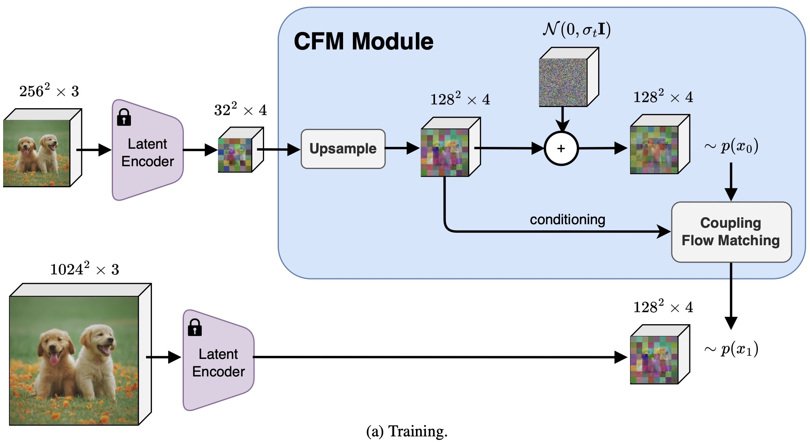
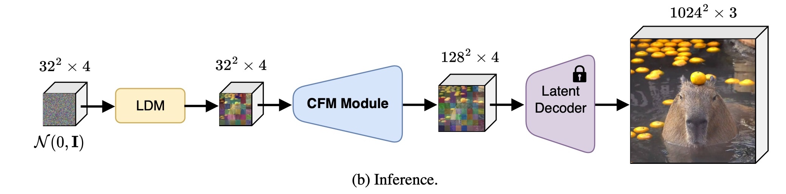
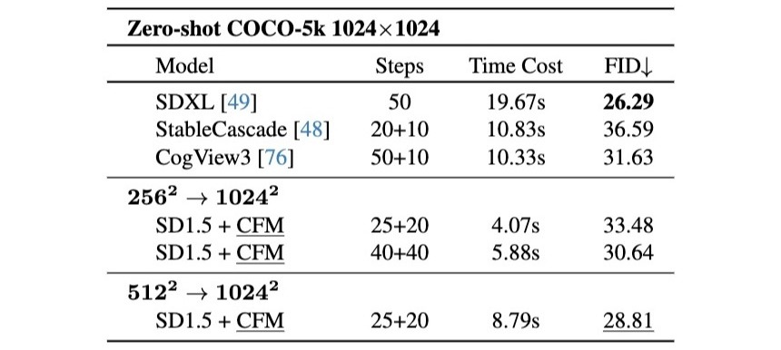
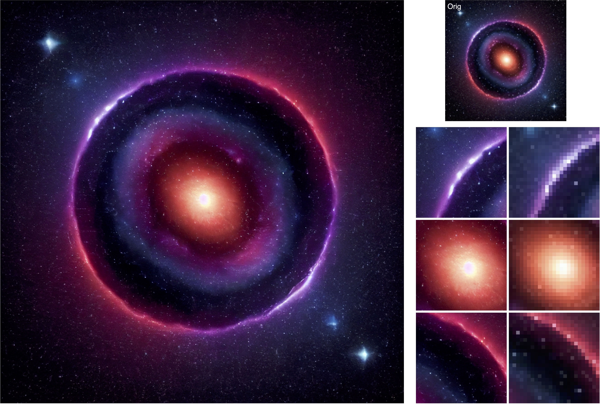

<p align="center">
 <h2 align="center">🚀 Boosting Latent Diffusion with Flow Matching</h2>
 <p align="center"> 
 Johannes S. Fischer<sup>*</sup> · Ming Gui<sup>*</sup> · Pingchuan Ma<sup>*</sup> · 
 <!-- </p>
  <p align="center">  -->
 Nick Stracke · Stefan A. Baumann ·Vincent Tao Hu · Björn Ommer
 </p>
 <p align="center"> 
    <b>CompVis Group @ LMU Munich</b>
 </p>
 </p>
  <p align="center"> <sup>*</sup> <i>equal contribution</i> </p>
</p>

<p align="center">
 <b>ECCV 2024 Oral</b>
</p>

<p align="center">
&rArr; <b>code coming soon!</b>
</p>

[](https://compvis.github.io/fm-boosting/)
[](https://arxiv.org/abs/2312.07360)


**Samples synthesized in $1024^2$ px.** We elevate DMs and similar architectures to a higher-resolution domain, achieving exceptionally rapid processing speeds. We leverage the [Latent Consistency Models (LCM)](https://arxiv.org/abs/2310.04378), distilled from [SD1.5](https://arxiv.org/abs/2112.10752)  and [SDXL](https://arxiv.org/abs/2307.01952), respectively. To achieve the same resolution as LCM (SDXL), we boost LCM-SD1.5 with our general Coupling Flow Matching (CFM) model. This yields a further speedup in the synthesis process and enables the generation of high-resolution images of high fidelity in an average $`0.347`$ seconds. The LCM-SDXL model fails to produce competitive results within this shortened timeframe, highlighting the effectiveness of our approach in achieving both speed and quality in image synthesis.


## 📝 Overview

In this work, we leverage the complementary strengths of Diffusion Models (DMs), Flow Matching models (FMs), and Variational AutoEncoders (VAEs): the diversity of stochastic DMs, the speed of FMs in training and inference stages, and the efficiency of a convolutional decoder to map latents into pixel space. This synergy results in a small diffusion model that excels in generating diverse samples at a low resolution. Flow Matching then takes a direct path from this lower-resolution representation to a higher-resolution latent, which is subsequently translated into a high-resolution image by a convolutional decoder. We achieve competitive high-resolution image synthesis at $1024^2$ and $2048^2$ pixels with minimal computational cost.

## 🚀 Pipeline

During training we feed both a low- and a high-res image through the pre-trained encoder to obtain a low- and a high-res latent code. Our model is trained to regress a vector field which forms a probability path from the low- to the high-res latent within $t \in [0, 1]$.



At inference we can take any diffusion model, generate the low-res latent, and then use our Coupling Flow Matching model to synthesize the higher dimensional latent code. Finally, the pre-trained decoder projects the latent code back to pixel space, resulting in $1024^2$ or $2048^2$ images.




## 📈 Results

We show zero-shot quantitative comparison of our method against other state-of-the-art methods on the COCO dataset. Our method achieves a good trade-off between performance and computational cost.



We can cascade our models to increase the resolution of a $128^2$ px LDM 1.5 generation to a $2048^2$ px output.



You can find more qualitative results on our [project page](https://compvis.github.io/fm-boosting/).


## 🎓 Citation

Please cite our paper:

```bibtex
@misc{fischer2023boosting,
      title={Boosting Latent Diffusion with Flow Matching}, 
      author={Johannes S. Fischer and Ming Gui and Pingchuan Ma and Nick Stracke and Stefan A. Baumann and Vincent Tao Hu and Björn Ommer},
      year={2023},
      eprint={2312.07360},
      archivePrefix={arXiv},
      primaryClass={cs.CV}
}
```
